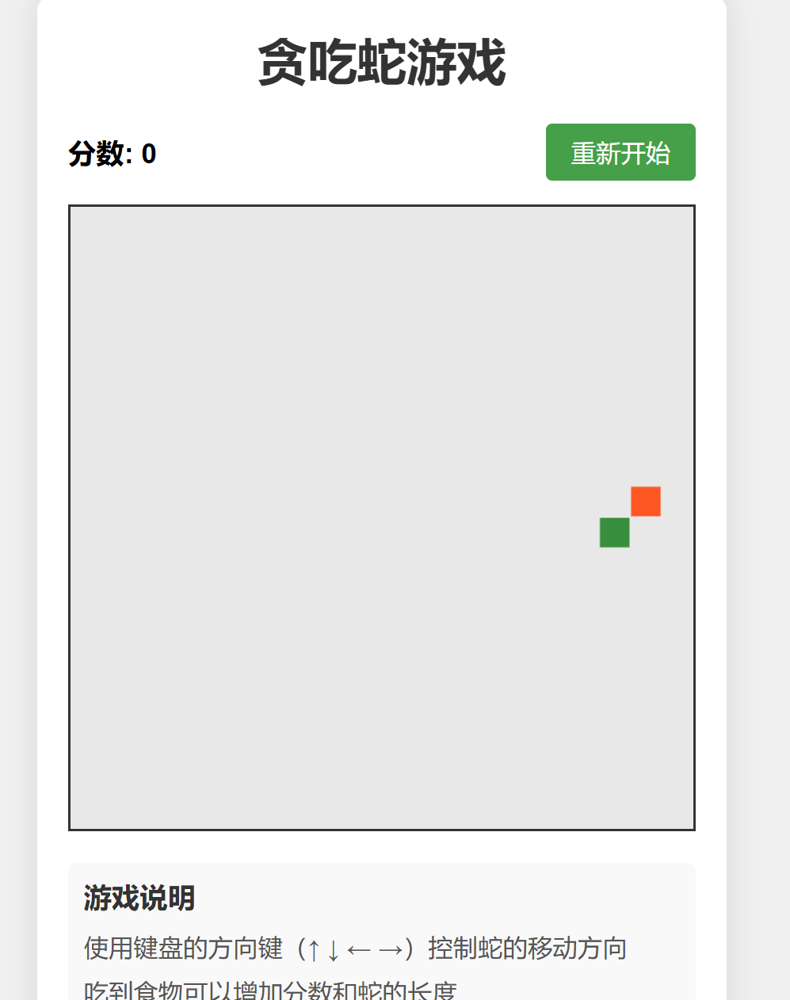

tatsu# 贪吃蛇游戏

一个使用HTML, CSS和JavaScript实现的经典贪吃蛇游戏。



## 游戏介绍

这是一个简单而经典的贪吃蛇游戏，玩家控制一条蛇在游戏区域内移动，吃到食物后蛇身会变长，同时得分增加。游戏的目标是尽可能地获得高分，同时避免蛇撞到墙壁或自己的身体。

## 游戏特点

- 简洁美观的用户界面
- 流畅的游戏体验
- 随机生成食物
- 实时分数显示
- 游戏难度随分数增加而提高（蛇移动速度加快）
- 游戏结束提示和重新开始功能

## 文件结构

```
snake-game/
├── index.html    # 游戏主页面
├── style.css     # 游戏样式
├── game.js       # 游戏逻辑
└── README.md     # 项目说明文档
```

## 如何运行

1. 克隆或下载本项目到本地
2. 直接在浏览器中打开`index.html`文件即可开始游戏

无需安装任何依赖或运行任何服务器，这是一个纯前端项目。

## 游戏操作

- 点击"开始游戏"按钮开始游戏
- 使用键盘方向键（↑ ↓ ← →）控制蛇的移动方向
- 游戏结束后点击"重新开始"按钮可以重新开始游戏

## 技术实现

游戏使用以下技术实现：

- **HTML5 Canvas**: 用于绘制游戏界面
- **CSS3**: 用于样式和布局
- **JavaScript**: 用于游戏逻辑实现

主要功能实现：

1. 使用Canvas绘制游戏元素（蛇和食物）
2. 使用setInterval实现游戏循环
3. 使用事件监听器捕获键盘输入
4. 使用数组存储蛇的身体部分
5. 实现碰撞检测逻辑
6. 实现食物随机生成逻辑

## 可能的改进

未来可能的改进方向：

- 添加游戏音效
- 实现游戏暂停功能
- 添加不同难度级别
- 保存最高分记录
- 添加障碍物
- 实现移动设备触摸控制
- 添加多种游戏模式

## 贡献

欢迎提出建议和改进意见！

## 许可

MIT许可证